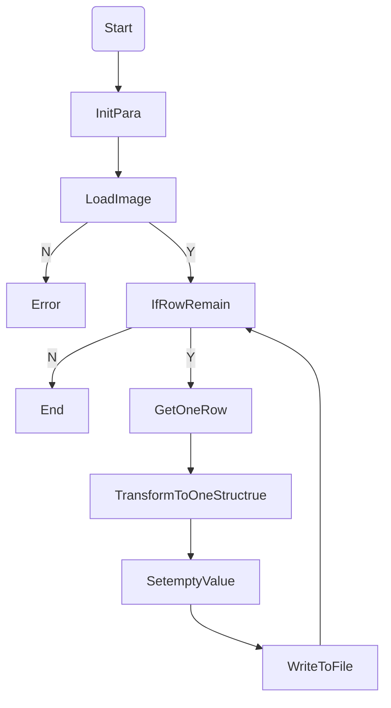
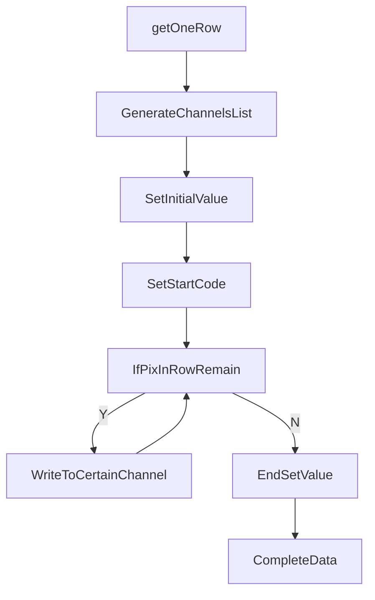

# 226&178模拟输入

## 1. 要求
- 按照相应文档`\doc\refer\IMX178LQJ-C_Data_Sheet.pdf`及`\doc\refer\IMX226CQJ-C_(E)Data_Sheet_E14615.pdf`，编写一个模块，将一张黑白图片转换成模拟输入文件。结构详见`IMX226CQJ-C_(E)Data_Sheet_E14615.pdf`第53页
- 若干参数可变：channel bit(8,10,12) 存储数据位数(4,8)
- 同时适应178与226
- 图片过大取合适大小；图片过小用无效数字填充

## 2. 实现流程

- Overlook



- [TransformToOneStructrue] in Overlook



  ## Question

- 一行采集完后，是否会有对齐/等待过程

  ```
  不同行之间有几百个无效数据点
  ```

  

 